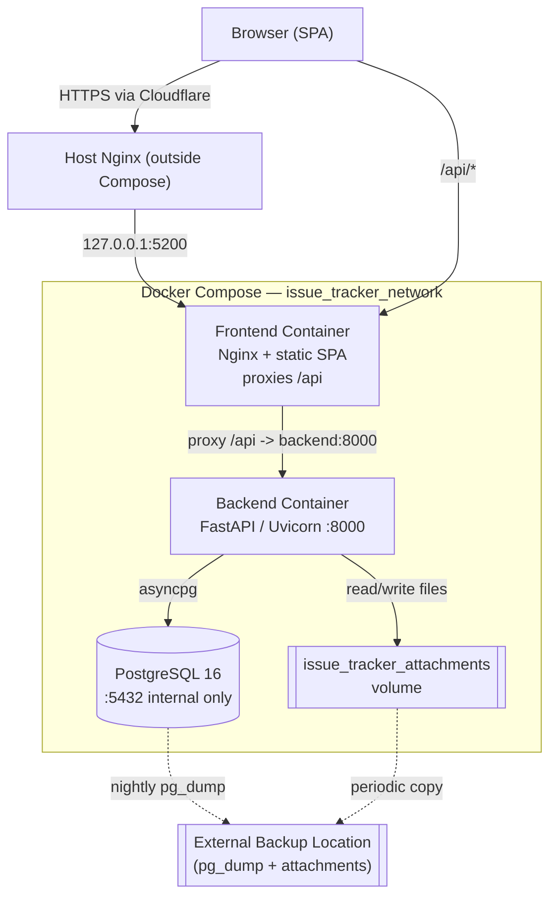

# Architecture — Project Meeting Issue Tracker

> Concept by MrHan (08974747477)
> Status: **Phase 1 skeleton** (design only — nothing is built or run yet)

An internal web application for the Project Control team to record, monitor, and
control issues and follow-ups discussed across many project meetings.

**Core principle:** the **Issue** is the primary entity. A meeting is only a
*source* or *context* for an update to an issue. One issue keeps **one Issue ID**
no matter how many meetings discuss it.

---

## 5.1 System Context

- A user opens a **browser** on the internal/allowed network.
- The browser loads the **frontend** (static SPA served by Nginx inside the
  frontend container).
- The frontend calls the **backend** under the `/api` path.
- The backend reads/writes **PostgreSQL** (dedicated container, internal only).
- File **attachments** are stored on a **persistent volume** mounted into the
  backend container (path `STORAGE_PATH`, default `/app/storage`).
- The **host Nginx** and **Cloudflare Tunnel** live *outside* the Compose stack
  and are not modified by this project. They terminate/route public traffic and
  forward to the frontend's host binding (`127.0.0.1:5200`).
- **Email / WhatsApp** integrations are **not** part of the MVP. A notification
  center lives *inside* the app; an outbound channel is a later phase.

```
[Browser] --https--> [Cloudflare Tunnel] --> [Host Nginx] --> 127.0.0.1:5200
                                                                  |
                                                        [Frontend container: Nginx]
                                                         static SPA  +  /api proxy
                                                                  |
                                                        [Backend container: FastAPI :8000]
                                                                  |               \
                                                        [PostgreSQL :5432]   [Attachment volume]
                                                         (internal only)      (/app/storage)
```

---

## 5.2 Component Diagram



Only the **frontend** binds a host port (`127.0.0.1:5200`). Backend and Postgres
are reachable **only** on the internal Docker network.

---

## 5.3 Request Flow

1. **Login** — Browser `POST /api/auth/login` with username/email + password.
   Backend verifies the password hash, issues a JWT (expiry
   `ACCESS_TOKEN_EXPIRE_MINUTES`). A successful/failed login is written to
   `audit_logs`. Password/token values are never logged.
2. **Create issue** — `POST /api/issues`. Backend validates (title required,
   `due_date >= raised_date`), generates a transaction-safe `issue_code`
   (`ISS-YYYY-NNNN`), sets status `OPEN`, writes the issue, the first
   `issue_updates` row, and an audit entry.
3. **Add meeting follow-up** — `POST /api/issues/{id}/updates` (or via the
   meeting-occurrence batch endpoint). Appends an `issue_updates` row; if status,
   PIC, or due date change, the before/after values are captured on that row and
   the parent issue's denormalized `last_update_*` fields are refreshed. Audit
   entry written.
4. **Close issue** — `POST /api/issues/{id}/close` requires `closure_note` and
   `closed_date`. Status → `CLOSED`. Append update + audit. Closed issues are
   excluded from overdue.
5. **Dashboard query** — `GET /api/dashboard/summary` etc. Read-only aggregate
   queries; overdue/stagnant are **computed at query time** (see §5.4, DB rules).
6. **Attachment upload** — `multipart/form-data` to the issue or update.
   Backend validates MIME type against `ATTACHMENT_ALLOWED_TYPES` and size
   against `ATTACHMENT_MAX_MB`, sanitizes the filename, stores under
   `STORAGE_PATH` with a generated `stored_filename`, records metadata +
   `checksum_sha256` in `attachments`, writes audit entry.

---

## 5.4 Security Boundary

- **Only** the frontend port binds the host (`127.0.0.1:5200`); the host Nginx /
  Cloudflare handle public exposure.
- **Backend and database are internal-only** — no `ports:` mapping for Postgres,
  no host bind for the backend.
- **Database is never exposed** to the internet or the host network.
- **Secrets via environment** only (`.env`, never committed). No secret has a
  production-usable default.
- **Passwords** stored as a strong hash (bcrypt/argon2 via passlib). Never logged.
- **Authentication** via JWT bearer tokens; **role-based authorization**
  (`ADMIN`, `EDITOR`, `VIEWER`) enforced on the backend for every endpoint.
- **Audit log** records create/edit/status/PIC/due-date/close/reopen/archive and
  login success/failure.
- **Upload validation** — allowed MIME types + size limit + sanitized filename +
  server-side re-check (never trust the client).
- **Timestamps stored in UTC** (`timestamptz`); **display timezone**
  `Asia/Jakarta` is applied at the presentation layer.

---

## 5.5 Deployment Model

- The VPS has **limited resources** (≈2–3 GB free RAM, swap full, 2 cores).
- **The frontend is NOT built on the VPS.** `npm install` / `vite build` can
  spike >1 GB RAM and risk OOM-killing the co-located trading services.
- Frontend **image / static artifact is built outside the VPS** (developer
  machine or CI) and pushed to a registry.
- The VPS only **pulls a ready image** (or receives a prebuilt static artifact)
  and runs it.
- **No Redis** in the MVP — JWT is stateless; no caching/queue need yet.
- PostgreSQL runs as a **dedicated container** with **no host port**, separate
  from the existing AI-XAUUSD Postgres (which must not be touched).

---

## 5.6 Non-Goals

This application is explicitly **not**:

- a full project management system;
- a document control system;
- a Primavera / P6 schedule replacement;
- a correspondence tracking system;
- an AI assistant;
- a real-time chat;
- a complex multi-step workflow-approval engine;
- a native mobile application.

Scope is deliberately narrow: **issue capture, follow-up history, and control
(overdue/stagnant/close/reopen)** driven from meetings.
