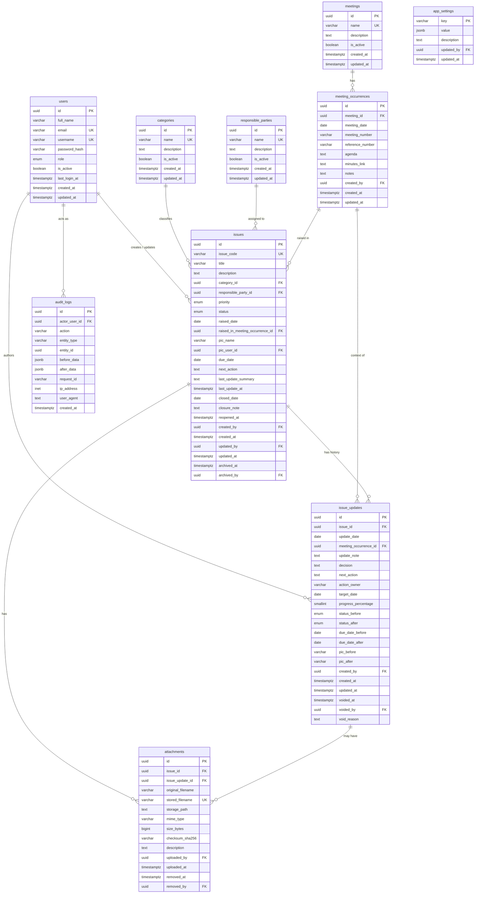

# Database Design — Project Meeting Issue Tracker

> Concept by MrHan (08974747477)
> Status: **Phase 1 design only.** No database, no migration, no tables are
> created in Phase 1. This document is the contract for Phase 2 modeling.

- Engine: **PostgreSQL 16 (Alpine)**, dedicated container, internal-only.
- Primary keys: **UUID** (`gen_random_uuid()` via `pgcrypto`, or app-generated).
- Timestamps: **`timestamptz`, stored in UTC.** Date-only business fields use
  `date`. Display timezone (`Asia/Jakarta`) is applied in the app layer.
- History is **append-only** (`issue_updates` is never hard-deleted).

---

## 9. ERD



> `audit_logs.entity_id` is a **logical** reference (no polymorphic FK), so any
> entity type can be audited without a hard foreign key.

---

## 7.1 Data Dictionary

### users
| column | type | null | notes |
|---|---|---|---|
| id | uuid | no | PK |
| full_name | varchar(150) | no | |
| email | varchar(255) | no | **unique**, validated |
| username | varchar(64) | no | **unique** |
| password_hash | varchar(255) | no | bcrypt/argon2; never logged |
| role | enum | no | `ADMIN` \| `EDITOR` \| `VIEWER` |
| is_active | boolean | no | default `true` |
| last_login_at | timestamptz | yes | |
| created_at | timestamptz | no | default now (UTC) |
| updated_at | timestamptz | no | |

### categories
| column | type | null | notes |
|---|---|---|---|
| id | uuid | no | PK |
| name | varchar(100) | no | **unique** |
| description | text | yes | |
| is_active | boolean | no | default `true` |
| created_at / updated_at | timestamptz | no | |

### responsible_parties
Same shape as `categories` (master data for the party responsible for an issue).

### meetings
Master **type** of meeting (not a single occurrence).
| column | type | null | notes |
|---|---|---|---|
| id | uuid | no | PK |
| name | varchar(150) | no | **unique** (e.g. "Weekly Progress Meeting") |
| description | text | yes | |
| is_active | boolean | no | default `true` |
| created_at / updated_at | timestamptz | no | |

### meeting_occurrences
A single instance of a meeting on a date.
| column | type | null | notes |
|---|---|---|---|
| id | uuid | no | PK |
| meeting_id | uuid | no | FK → meetings |
| meeting_date | date | no | required |
| meeting_number | varchar(50) | yes | e.g. "#14" |
| reference_number | varchar(100) | yes | MoM reference |
| agenda | text | yes | |
| minutes_link | text | yes | URL to minutes |
| notes | text | yes | |
| created_by | uuid | no | FK → users |
| created_at / updated_at | timestamptz | no | |

**Unique constraint (soft, sensible):**
`UNIQUE (meeting_id, meeting_date, meeting_number)` — prevents obvious duplicate
occurrences without being over-strict (a null `meeting_number` still allows
multiple same-day rows if genuinely needed).

### issues
| column | type | null | notes |
|---|---|---|---|
| id | uuid | no | PK |
| issue_code | varchar(30) | no | **unique**, `ISS-YYYY-NNNN` (backend-generated) |
| title | varchar(300) | no | required |
| description | text | no | |
| category_id | uuid | no | FK → categories |
| responsible_party_id | uuid | yes | FK → responsible_parties |
| priority | enum | no | `LOW`\|`MEDIUM`\|`HIGH`\|`CRITICAL` |
| status | enum | no | `OPEN`\|`IN_PROGRESS`\|`PENDING`\|`CLOSED`\|`REOPENED` |
| raised_date | date | no | required |
| raised_in_meeting_occurrence_id | uuid | yes | FK → meeting_occurrences |
| pic_name | varchar(150) | yes | free text PIC |
| pic_user_id | uuid | yes | FK → users, if PIC is internal |
| due_date | date | yes | must be `>= raised_date` |
| next_action | text | yes | |
| last_update_summary | text | yes | denormalized convenience (see rule 11) |
| last_update_at | timestamptz | yes | denormalized convenience |
| closed_date | date | yes | required when status = CLOSED |
| closure_note | text | yes | required when status = CLOSED |
| reopened_at | timestamptz | yes | |
| created_by | uuid | no | FK → users |
| created_at | timestamptz | no | |
| updated_by | uuid | yes | FK → users |
| updated_at | timestamptz | no | |
| archived_at | timestamptz | yes | soft archive |
| archived_by | uuid | yes | FK → users |

> `last_update_summary` / `last_update_at` are a **deliberate, documented**
> denormalization for cheap register/dashboard rendering (rule 11 exception).
> They are derived from `issue_updates` and can be rebuilt.

### issue_updates (append-only history)
| column | type | null | notes |
|---|---|---|---|
| id | uuid | no | PK |
| issue_id | uuid | no | FK → issues |
| update_date | date | no | |
| meeting_occurrence_id | uuid | yes | FK; **null = update outside a meeting** |
| update_note | text | no | |
| decision | text | yes | |
| next_action | text | yes | |
| action_owner | varchar(150) | yes | |
| target_date | date | yes | |
| progress_percentage | smallint | yes | `CHECK 0..100` |
| status_before / status_after | enum | yes | captured when status changes |
| due_date_before / due_date_after | date | yes | captured when due date changes |
| pic_before / pic_after | varchar(150) | yes | captured when PIC changes |
| created_by | uuid | no | FK → users |
| created_at | timestamptz | no | |
| updated_at | timestamptz | yes | |
| voided_at | timestamptz | yes | correction mechanism (Admin only) |
| voided_by | uuid | yes | FK → users |
| void_reason | text | yes | |

### attachments
| column | type | null | notes |
|---|---|---|---|
| id | uuid | no | PK |
| issue_id | uuid | no | FK → issues |
| issue_update_id | uuid | yes | FK → issue_updates |
| original_filename | varchar(255) | no | as uploaded |
| stored_filename | varchar(255) | no | **unique**, generated |
| storage_path | text | no | under `STORAGE_PATH` |
| mime_type | varchar(150) | no | validated against allow-list |
| size_bytes | bigint | no | validated against limit |
| checksum_sha256 | varchar(64) | yes | integrity |
| description | text | yes | |
| uploaded_by | uuid | no | FK → users |
| uploaded_at | timestamptz | no | |
| removed_at | timestamptz | yes | soft remove (no hard delete via UI) |
| removed_by | uuid | yes | FK → users |

### audit_logs
| column | type | null | notes |
|---|---|---|---|
| id | uuid | no | PK |
| actor_user_id | uuid | yes | FK; null for anonymous/failed login |
| action | varchar(80) | no | e.g. `issue.create`, `auth.login_failed` |
| entity_type | varchar(60) | no | e.g. `issue`, `user` |
| entity_id | uuid | yes | logical reference (no FK) |
| before_data | jsonb | yes | redacted; no secrets |
| after_data | jsonb | yes | redacted; no secrets |
| request_id | varchar(64) | yes | correlation id |
| ip_address | inet | yes | |
| user_agent | text | yes | |
| created_at | timestamptz | no | |

### app_settings
| column | type | null | notes |
|---|---|---|---|
| key | varchar(100) | no | PK |
| value | jsonb | no | |
| description | text | yes | |
| updated_by | uuid | yes | FK → users |
| updated_at | timestamptz | no | |

Seeded keys: `stagnant_days`, `attachment_max_mb`, `attachment_allowed_types`,
`issue_code_prefix`, `display_timezone`. Env values are defaults; admin overrides
live here.

---

## 8. Database Business Rules

1. A new issue is always `OPEN`.
2. `issue_code` is generated by the backend in a **transaction-safe** way
   (per-year sequence; unique constraint is the final guard). No duplicate codes.
3. `due_date` must not be earlier than `raised_date` (`CHECK`).
4. A closed issue requires both `closed_date` and `closure_note`.
5. Reopen requires a reason, recorded as an `issue_updates` row.
6. A closed issue is not edited directly.
7. An issue must be reopened before operational changes.
8. `issue_updates` are never hard-deleted (correction = void + replacement).
9. Attachments are never hard-deleted from the UI (soft `removed_at`).
10. Audit logs are never editable through the UI.
11. Calculated fields are not stored **unless** documented (the `last_update_*`
    denormalization is the only exception, for register/dashboard performance).
12. **Overdue** = status ≠ `CLOSED` **and** `due_date < current local date`.
13. **Stagnant** = status ≠ `CLOSED` **and** last update older than the threshold.
14. If an issue was never updated, `raised_date` is the stagnant baseline.
15. `progress_percentage` is constrained to `0..100`.
16. `meeting_occurrence_id` on an update may be null (update outside a meeting).
17. Every status / PIC / due-date change produces an `issue_updates` row **and**
    an `audit_logs` row.
18. All timestamps are stored in **UTC**.
19. Date-only business fields are stored as `date`.
20. Enforce with **database constraints** wherever the rule is DB-enforceable
    (unique codes, enum values, `CHECK` on progress and due/raised dates,
    FK integrity).

### Enum reference
- `user_role`: `ADMIN`, `EDITOR`, `VIEWER`
- `issue_priority`: `LOW`, `MEDIUM`, `HIGH`, `CRITICAL`
- `issue_status`: `OPEN`, `IN_PROGRESS`, `PENDING`, `CLOSED`, `REOPENED`

### Status lifecycle (enforced in the service layer)
```
OPEN        -> IN_PROGRESS | PENDING
IN_PROGRESS -> PENDING | CLOSED
PENDING     -> IN_PROGRESS | CLOSED
CLOSED      -> REOPENED
REOPENED    -> IN_PROGRESS | PENDING
```
Every transition writes an `issue_updates` row and an `audit_logs` row.

---

## Migration status (Phase 2A)
- Initial migration: `alembic/versions/0d3d40690d49_initial_schema_phase_2a.py`
  (revision `0d3d40690d49`, down_revision `None`).
- Enum storage decision: **string-backed** (VARCHAR + CHECK constraint), not
  native PostgreSQL ENUM — portable to SQLite for tests, easy to evolve.
- Portable types: `before_data`/`after_data`/`app_settings.value` are JSON with a
  `JSONB` variant on PostgreSQL; `audit_logs.ip_address` is `VARCHAR(45)` with an
  `INET` variant on PostgreSQL. Tests (SQLite) build the schema via
  `Base.metadata.create_all`; the migration is PostgreSQL-targeted.
- Validated: `alembic upgrade head` + `alembic downgrade base` on SQLite, and
  `alembic check` (models ↔ migration parity). **NOT** executed on PostgreSQL /
  the production VPS in Phase 2A.
